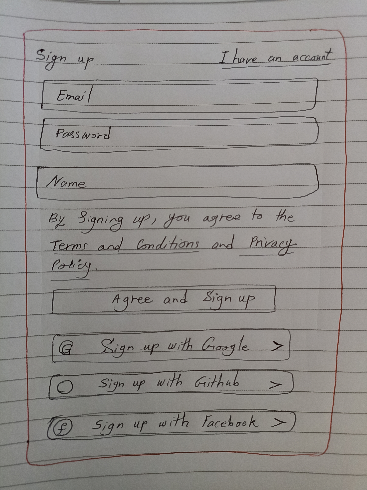
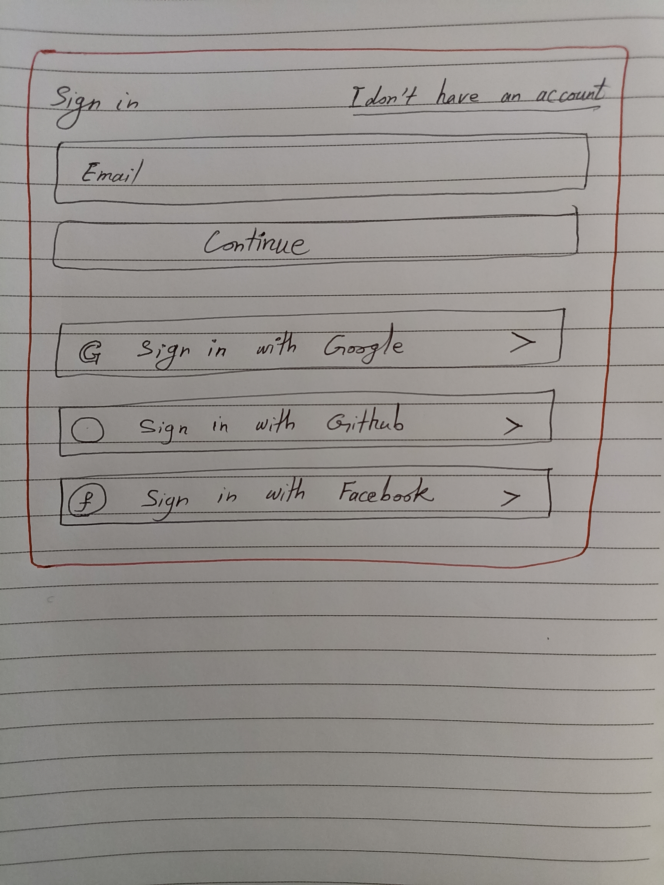
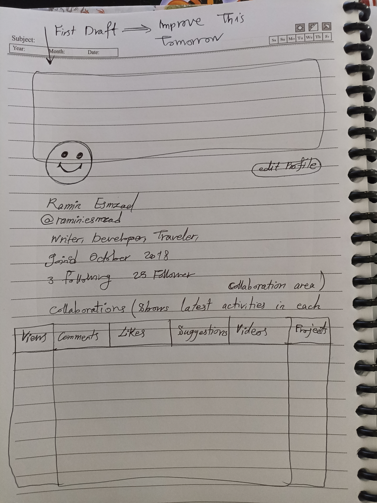

# How to design a social network platform?

As you know, there are a plethora of social network platforms out there, so it is not a new concept and new idea. But, as this channel aims to teach new concepts and new skills, it is a good idea to consider a real life project for the channel and develop it along the way with the help of you. This is a collaborative channel, so I appreciate any suggestion, any contribution and collaboration to improve the channel and also the platform. The name of the platform that we're going to develop is **CollabShare**, which means that we ==collaborate== together and ==share== the platform (benefits and drawbacks) toghether. 

So, our destination is clear, but we have to have a good system to acheive this goal. As a result, we must focus on the process and how to do the task. This is a channel that documents our journey on developing a new type of social network platform. Until finding a good approach, we may need to try different methods and see which one is more effective. 

In this video, we want to explore the process of designing a social network platform and highlight the features that we want to implement a long the way. It must be noted that, the features and capabilities that we want to add or remove may change during the process as we go toghether and discuss toghether to reach a nice platform. So, we always have a feedback that corrects our path and our approach to reach the goal. In other words, we always try to improve little by little on a daily basis.

So let's cut to chase and start the task. 
First of all lets define a social network platform and its categorization. 

## What is a Social Network Platform?
As it is stated in **wikipedia.org**, social networking service (site) is an online platform which people use to build social networks or social relationships with other people who share similar personal or career content, interests, activities, backgrounds, or real-life connections. It is clear that in this definition, people share many things but the platform. The platform is for others that do not want to share it with people. This is where the problem arises. Here, we address this issue and design a new platform to enable real sharing. 

## Types of Social Media Apps
There are 5 major types of social media platforms, namely:
1. Social networks 
The aim of this platforms is to let you connect with people, but they use different approaches to acheive it. For example, the Facebook connects friends and families toghether. On the other hand, the Linkedin connects professionals around the globe. 

2. Media Sharing Networks
These platforms have been used so far for uploading and sharing media, written content, comment posts, post content on other social media apps. Examples of this category would be Instagram and Snapchat.

3. Social Media Blogs
We may put youtube, pinterest, and twitter in this category. We can use thier tools to push content online. 

4. Community and discussion forums
In this platforms, users share their opinions about various topics, Examples included Reddit, and Quora. 

5. Consumer Reviews Networks
These types of platforms allow customers to read online reviews about an specific product before purchasing it. For example, tripadviser, and yelp are two of them.

## How to create a social network platform?
The first step is to figure out the ==concept of our future social application platform==. In other words, we must understand the value that this platform brings to its audience, also who is going to use this platform, and finally the functionality of the platform's app. 

Let's talk about the value that this platform will bring to its users. As I said before, the main purpose of this platform is to value collaborators' efforts and give them the percents of the platform's earnings based on their efforts. This is a new concept, and the philosophy behind it is that we see users as the collaborators and also owners of the platform. They are not users and consumers of data. They are participators. The universe is based on participation not observation. In terms of the audiences of the platform, each indivdual with any experience and knowledge that can add some value to the platform will use the platform. We appreciate every moment of your life. You contribute to the platform and the platform is yours. You just need to show your talent and effort to the global society of this new app. For the platform's functionality, we list the common features and modify them along the way. Some features that most modern social network platforms must have are:
1. Signup
It is vital to provide different authentication methods, such as, email, phone, and other social platform's accounts. For example, collaborators can register through their twitter account, or github account. 
2. Collaborator profile
A modern looking profile with various detail and info with good UI/UX. Also, we must provide some profile customization features to help them draw the attention of other collaborators. 
3. News feed
Show various contents based on collaborators preferences.
4. Chat
Online chat is a must-have feature of the platform that we must implement it with elaborate design. Features such as instant messaging and phone calls are vital to the success of the platform. Also, collaborators must be able to share photos, videos, and other contents.
5. Search
Advanced and high-performance search option
6. Post creation
This is where collaborators can show their talents, their works, and their suggestions.
7. Push notifications
It is a really handy tool to help collaborators be engaged with the platform and also it is necessary to inform them about new updates of their account and also the platform.
8. Platform Development Guidelines
In this section, which is the cornerstone of the platform, I'm going to teach how to develop this platform step by step with all related details. This is where the collaborators can participate in the project and be one of its owners. 
9. An Engaging Landing Page
It is where, the latest statistics related to the platform will be shown, such as the number of collaborators, their share, number of videos, ... . Also, the latest videos of the platform will be shown. This page is going to change a lot during the development, so we have tons of work and brainstorming here. 

Next Task: Sketching the different Pages of the Platform
## First Draft of The Platform By Hand
In this section, we will sketch the different pages of the platform. This is the first version of the platform and it will be improved as time goes by. I just want to sketch simple layouts to start with. Then we can improve it toghether by discussion and collaboration. So, let's sketch.

### Signup/Login
The sign up and sign in pages are similar to those provided by *Grammarly*.
> Sign up page

 
> Sign in page

### Collaborator Profile
The first version of collaborator's profile is as:

In this page, we show the collaboration of the collaborators in different areas and also we show some statistics about his/her status among other collaborators. Some info like the collaborator's overall share of the platform, their contribution index, withdrawals and disposal status, and many others that will be clear and added in future versions and improvements. 

I have to look at my previous UI design for this platform about 1 and half years ago. And add those ideas here.